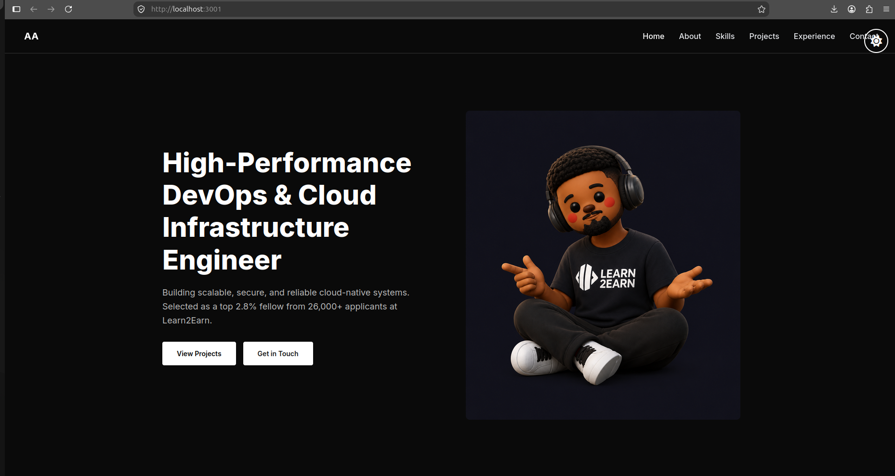
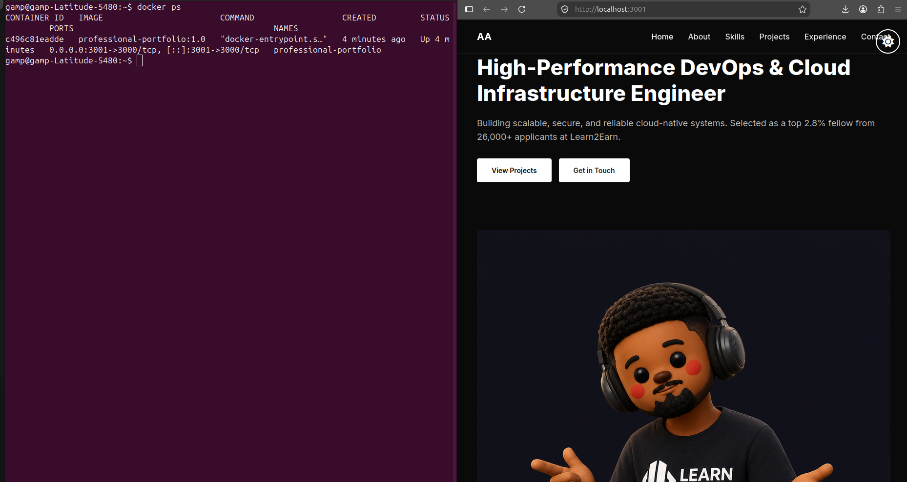

# Professional Portfolio

A modern personal portfolio website built with Next.js and React. The portfolio showcases my background, technical skills, projects, and professional experience through a responsive and interactive web interface.

The application was originally developed and deployed using Vercel. As part of my DevOps and Cloud Engineering internship, I prepared the application for containerized deployment using Docker.

---

## App Runing

The portfolio application running successfully inside a Docker container.

<p align="center">
  
</p>

## Docker Container Running

The portfolio application running successfully inside a Docker container port 3000.

<p align="center">
  
</p>

## 🚀 Project Overview

The Professional Portfolio is a web application designed to present my professional profile and technical work in a clean and responsive interface.

The application includes sections for:

- About Me
- Technical Skills
- Projects
- Professional Experience
- Education
- Contact Information

The project uses Next.js and React for the frontend and is designed to be easily deployed across different environments.

---

## 🛠️ Technologies Used

- **Next.js**
- **React**
- **TypeScript**
- **Tailwind CSS**
- **Lucide React**
- **pnpm**
- **Docker**

---

## 📁 Project Structure

```text
professional-portfolio/
│
├── app/                    # Next.js application pages and routes
├── components/             # Reusable React components
├── lib/                    # Utility functions
├── public/                 # Static assets
│
├── Dockerfile              # Docker image configuration
├── .dockerignore           # Files excluded from Docker build context
├── pnpm-workspace.yaml     # pnpm build configuration
├── package.json            # Project dependencies and scripts
├── pnpm-lock.yaml          # Dependency lockfile
├── next.config.mjs         # Next.js configuration
├── tsconfig.json            # TypeScript configuration
└── README.md               # Project documentation
````

---

# 🐳 DevOps & Containerization

As part of my DevOps and Cloud Engineering internship, I containerized this application using Docker.

The objective was to prepare the existing web application so that it could run consistently in an isolated environment without requiring the host machine to have the application's dependencies installed.

## Containerization Approach

A multi-stage Docker build was used to create the application image.

The Dockerfile contains three stages:

### 1. Dependencies Stage

The first stage uses Node.js Alpine Linux and installs the project dependencies using pnpm.

```dockerfile
FROM node:22-alpine AS deps
```

The project dependency files are copied into the image and dependencies are installed using:

```bash
pnpm install --frozen-lockfile
```

### 2. Build Stage

The second stage copies the installed dependencies and application source code before creating the production build.

```bash
pnpm build
```

This generates the optimized Next.js application inside the `.next` directory.

### 3. Production Stage

The final stage contains the files required to run the production application.

The application is started using:

```dockerfile
CMD ["node_modules/.bin/next", "start", "-H", "0.0.0.0"]
```

The application listens on port `3000` inside the container.

---

# 🔨 Building the Docker Image

Make sure Docker is installed and running.

Clone the repository and navigate into the project directory:

```bash
git clone <repository-url>
cd professional-portfolio
```

Build the Docker image:

```bash
docker build -t professional-portfolio:1.0 .
```

Verify that the image was created:

```bash
docker images
```

You should see:

```text
professional-portfolio   1.0
```

---

# ▶️ Running the Application with Docker

Start a container from the Docker image:

```bash
docker run -d \
  --name professional-portfolio \
  -p 3001:3000 \
  professional-portfolio:1.0
```

The command maps port `3001` on the host machine to port `3000` inside the Docker container.

```text
Host Machine
localhost:3001
      │
      ▼
Docker Container
port 3000
      │
      ▼
Next.js Application
```

---

# 🌐 Accessing the Application

Once the container is running, open the following URL in a web browser:

```text
http://localhost:3001
```

The portfolio should load from the Docker container.

---

# 🔍 Checking the Container

To view running containers:

```bash
docker ps
```

To view application logs:

```bash
docker logs professional-portfolio
```

To inspect the container:

```bash
docker inspect professional-portfolio
```

---

# 🛑 Stopping the Container

To stop the running container:

```bash
docker stop professional-portfolio
```

To remove the container:

```bash
docker rm professional-portfolio
```

To remove the Docker image:

```bash
docker rmi professional-portfolio:1.0
```

---

# 📸 Docker Containerization Evidence

The application was successfully built into a Docker image and run inside a Docker container.

Evidence includes:

- Docker image successfully built
- Docker container successfully running
- Portfolio accessible through the mapped Docker port
- Docker container status verified using `docker ps`
- Application logs verified using `docker logs`

A screenshot showing the portfolio running alongside the active Docker container is included as part of the internship deliverables.

---

# ⚠️ Challenges Encountered

During the containerization process, several challenges were encountered.

### 1. Dependency Build Scripts

The project uses pnpm 11, which introduced restrictions around dependency build scripts.

Packages such as `sharp` and `msw` initially caused the Docker build to fail because their build scripts were not automatically permitted.

This was resolved by configuring the pnpm workspace to explicitly allow the required build dependencies.

### 2. Docker Port Conflict

The application initially attempted to use port `3000` on the host machine, but the port was already occupied.

The container was therefore mapped to port `3001` on the host while keeping port `3000` inside the container:

```text
3001:3000
```

### 3. Container Runtime Configuration

The application needed to listen on all network interfaces inside the container.

The production command was configured to use:

```bash
-H 0.0.0.0
```

This allowed the application to receive requests through Docker's port mapping.

---

# 💡 Benefits of Docker

Containerization improves the deployment process by providing a consistent environment for running the application.

Some benefits include:

- **Consistency:** The application runs with the same dependencies and runtime environment across machines.
- **Portability:** The application can be moved between development, testing, and production environments.
- **Isolation:** Application dependencies are isolated from the host operating system.
- **Simplified deployment:** The application can be packaged as a Docker image and deployed to different environments.
- **Scalability:** Containers can be replicated and managed using container orchestration platforms such as Kubernetes.
- **Faster onboarding:** Developers can start the application without manually installing all project dependencies.

---

# 🧑‍💻 DevOps Skills Practiced

Through this project, I practiced:

- Git and GitHub
- Version control
- Meaningful Git commits
- Docker
- Dockerfiles
- Multi-stage Docker builds
- Docker images
- Docker containers
- Port mapping
- Container logs
- Environment configuration
- Application containerization
- Technical documentation

---

# 🔮 Future DevOps Improvements

The containerized application can be extended with additional DevOps practices, including:

- GitHub Actions CI/CD
- Automated Docker image builds
- Docker image publishing to Docker Hub or GitHub Container Registry
- Cloud deployment
- Infrastructure as Code
- Application monitoring
- Container health checks
- Automated testing
- Security scanning
- Kubernetes deployment

These improvements can be introduced in subsequent stages of the DevOps and Cloud Engineering internship.

---

# 📄 License

This project is intended for educational and portfolio purposes.

````

### One thing I would change before you paste it

In this section:

```markdown
git clone <repository-url>
````

replace `<repository-url>` with your **actual GitHub repository URL**.

Also, don't add the screenshot yet if you haven't created it. Once you have the screenshot, we can add something like:
